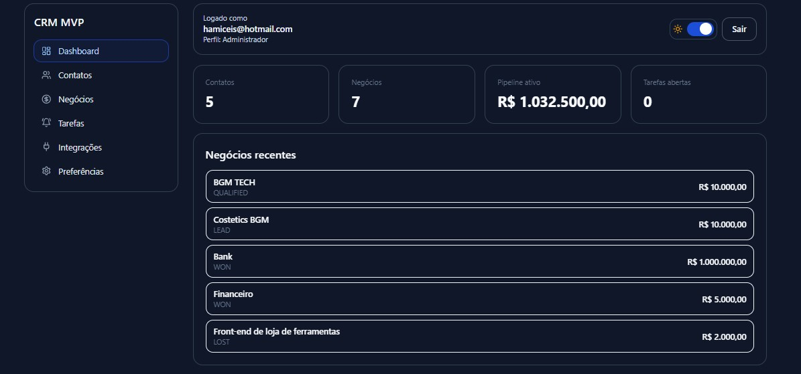

# CRM MVP

CRM web para pequenas equipes comerciais organizarem contatos, negócios, tarefas e lembretes em um único lugar.



## Para quem é este projeto

- Pequenas empresas B2B/B2C que vendem por relacionamento
- Times de vendas com operação enxuta (1 a 20 vendedores)
- Negócios que hoje controlam leads em planilha e precisam de processo

## Problema que ele resolve no dia a dia

No uso diário, o CRM resolve 4 dores principais:

1. **Não perder follow-up**: tarefas com data/hora e status
2. **Não perder contexto**: histórico de contatos e negócios no pipeline
3. **Não depender de planilha**: informações centralizadas por conta
4. **Não fazer trabalho manual repetitivo**: integração via API para entrada de leads

## Principais funcionalidades

- Login com sessão JWT (NextAuth)
- Dashboard com indicadores (contatos, negócios, pipeline, tarefas abertas)
- Gestão de contatos
- Gestão de negócios (pipeline)
- Gestão de usuários (somente perfil ADMIN)
- Gestão de tarefas com:
  - criação
  - conclusão/reabertura (com feedback visual imediato)
  - edição completa e visualização de detalhes em Modal
  - exclusão
  - lembrete por data/hora
  - cores semânticas de prioridade (Alta, Média, Baixa)
- Integrações:
  - webhook/API para criação de leads
  - endpoint para disparo de lembretes de tarefas vencidas via WhatsApp
- Interface e UX:
  - Layout responsivo com sidebar desktop + menu mobile
  - Kanban Board otimizado: colunas independentes com altura fixa e scroll interno minimalista (previne quebra de layout com muitos cards)
  - Modais padronizados com uso de `createPortal`, fechamento via `Escape`, bloqueio de rolagem de fundo e backdrop em desfoque (blur).
  - Tema Claro e Escuro totalmente integrados.

## Stack técnica

- Next.js 15 (App Router)
- TypeScript (strict)
- Tailwind CSS
- Prisma + SQLite
- NextAuth (credenciais)
- Server Actions
- Componentes UI no padrão shadcn (base local + Radix/DayPicker onde aplicável)

## Regras de acesso

- `ADMIN`: acesso completo + gestão de usuários
- `SALES`: dashboard, contatos, negócios, tarefas e integrações

## Estrutura relevante

- `src/app/(auth)/login/page.tsx`: tela de login
- `src/app/(dashboard)/layout.tsx`: layout da área logada
- `src/app/(dashboard)/dashboard/page.tsx`: dashboard principal
- `src/app/(dashboard)/dashboard/contacts/page.tsx`: contatos
- `src/app/(dashboard)/dashboard/deals/page.tsx`: negócios
- `src/app/(dashboard)/dashboard/tasks/page.tsx`: tarefas
- `src/app/(dashboard)/dashboard/integrations/page.tsx`: integrações
- `src/app/(dashboard)/dashboard/settings/users/page.tsx`: usuários (admin)
- `src/actions/*`: server actions
- `src/app/api/integrations/lead/route.ts`: entrada de leads
- `src/app/api/integrations/tasks/reminders/route.ts`: execução de lembretes WhatsApp
- `prisma/schema.prisma`: modelo do banco

## Variáveis de ambiente

Use `.env` com os campos abaixo:

```env
DATABASE_URL="file:./dev.db"
AUTH_SECRET="sua-chave-segura"
AUTH_URL="http://localhost:3000"

SEED_ADMIN_EMAIL="admin@crm.local"
SEED_ADMIN_PASSWORD="Admin@123"
SEED_SALES_EMAIL="vendas@crm.local"
SEED_SALES_PASSWORD="Vendas@123"

INTEGRATION_API_KEY="chave-integracao"
INTEGRATION_COMPANY_ID="seed-company"

WHATSAPP_API_TOKEN="token-whatsapp"
WHATSAPP_PHONE_NUMBER_ID="phone-number-id"
WHATSAPP_TO_NUMBER="5511999999999"
REMINDER_RUN_KEY="chave-execucao-reminder"
```

## Como rodar localmente

1. Instalar dependências

```bash
npm install
```

2. Criar o `.env`

```bash
cp .env.example .env
```

3. Gerar client e preparar banco

```bash
npm run db:generate
npm run db:migrate -- --name init
npm run db:seed
```

4. Subir aplicação

```bash
npm run dev
```

Acesse: `http://localhost:3000/login`

## Credenciais iniciais (seed)

- Admin: `admin@crm.local` / `Admin@123`
- Vendas: `vendas@crm.local` / `Vendas@123`

## Fluxo operacional sugerido (dia a dia)

1. Entrar no dashboard pela manhã
2. Ver tarefas atrasadas e tarefas que vencem hoje
3. Executar follow-ups e marcar tarefas como concluídas
4. Atualizar negócios no pipeline conforme avanço
5. Inserir novos leads manualmente ou via API
6. No final do dia, revisar tarefas abertas e reagendar o necessário

## Integrações

### 1) Entrada de lead via API

Endpoint:

```http
POST /api/integrations/lead
```

Header:

```http
x-api-key: INTEGRATION_API_KEY
x-company-id: INTEGRATION_COMPANY_ID
```

Payload exemplo:

```json
{
  "name": "Maria Silva",
  "email": "maria@empresa.com",
  "phone": "+55 11 99999-0000",
  "company": "Empresa X",
  "source": "Landing Page",
  "dealTitle": "Plano Profissional",
  "dealValue": 3500,
  "stage": "LEAD"
}
```

### 2) Disparo de lembretes vencidos via WhatsApp

Endpoint:

```http
POST /api/integrations/tasks/reminders
```

Header:

```http
x-run-key: REMINDER_RUN_KEY
x-company-id: INTEGRATION_COMPANY_ID
```

Uso típico: agendar esse endpoint em cron (ex.: a cada 5 minutos).

### Limites de requisição

- Login por credenciais: até 5 tentativas por email a cada 10 minutos
- `POST /api/integrations/lead`: até 60 requisições por minuto por IP + company
- `POST /api/integrations/tasks/reminders`: até 12 requisições por minuto por IP + company

Quando o limite estoura, a API retorna `429 Too Many Requests` com header `Retry-After`.

Observação: o rate limit atual é em memória (por instância de aplicação).

## Scripts úteis

```bash
npm run dev
npm run build
npm run start
npm run lint
npm run db:generate
npm run db:migrate -- --name <nome>
npm run db:seed
```

## Observações técnicas

- O projeto usa Server Actions para mutações de dados.
- As tarefas estão persistidas e operacionais com consultas Prisma tipadas.
- Build e checagem de tipos estão passando.

## Próximas evoluções recomendadas

1. Toast global com fila (não só na tela de tarefas)
2. Histórico de mudanças de etapa em negócios
3. Filtro avançado de tarefas e pipeline
4. Testes de integração para fluxos críticos
